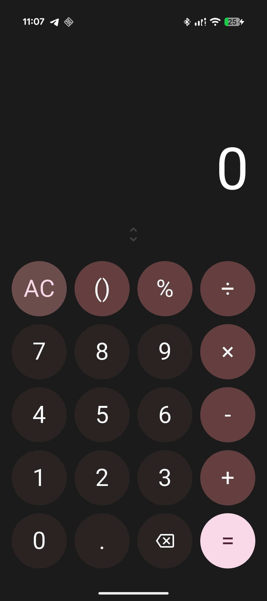
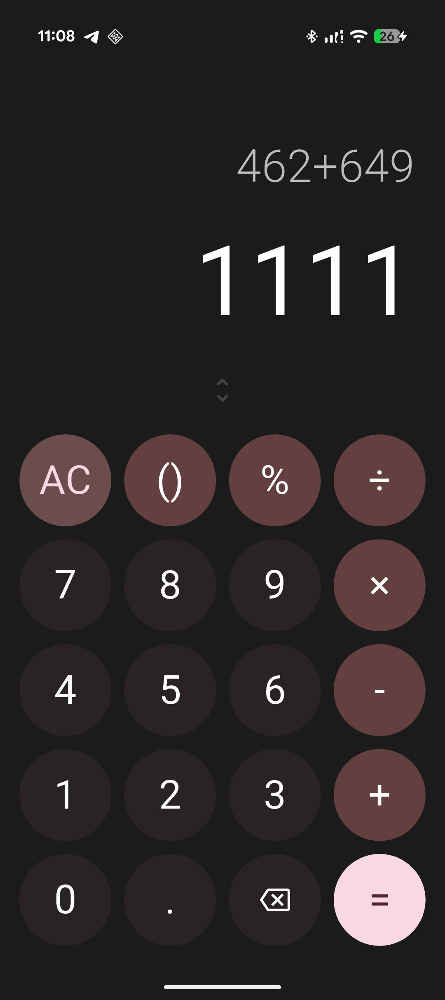
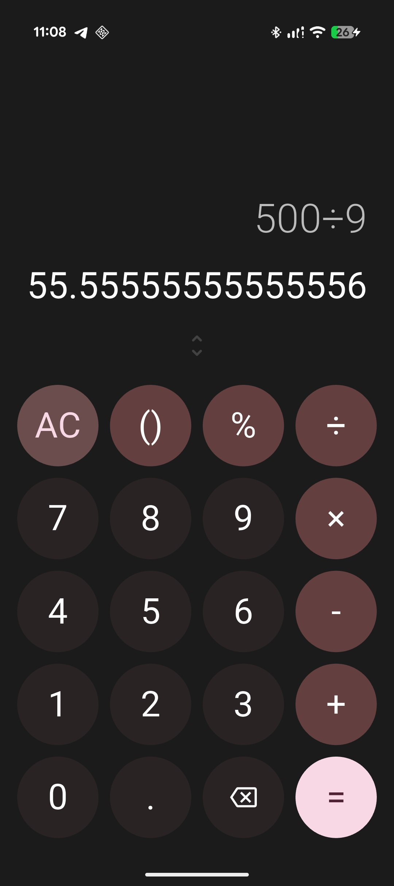
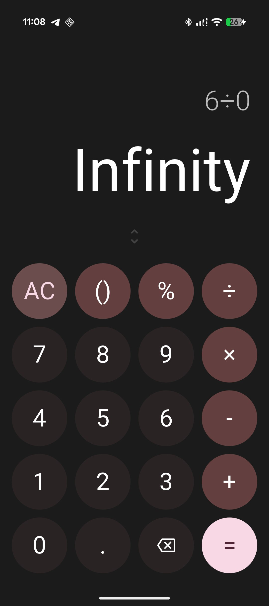

# Google Pixel Material You Calculator 📱

A stylish, fluid, and high-performance calculator built with Flutter. The design is heavily inspired by the **Material You** (Google Pixel) aesthetic, featuring a dynamic color scheme and adaptive UI elements.

## ✨ Features

* **Material Design 3**: Utilizes the latest Google design components and color palettes.
* **Adaptive Layout**: Circular buttons and spacing automatically scale to fit any screen width perfectly.
* **Lag-Free UX**: Optimized rendering ensures 60 FPS performance and zero input delay.
* **Haptic Feedback**: Provides a premium feel with light tactile vibrations on every button press.
* **Smart Display**: Includes an auto-scaling engine (FittedBox) to handle long calculations without breaking the UI.

## 📸 Screenshots

<table style="width: 100%">
  <tr>
    <td align="center"> Main Screen</td>
    <td align="center"> Addition</td>
    <td align="center"> Long Decimals</td>
    <td align="center"> Error Handling</td>
  </tr>
</table>

## 🛠 Tech Stack

* **Flutter**: Framework for building the cross-platform UI.
* **Dart**: The core programming language.
* **Expressions**: A powerful library for safe and efficient mathematical string evaluation.
* **Haptic Feedback**: Native system service for tactile response.

